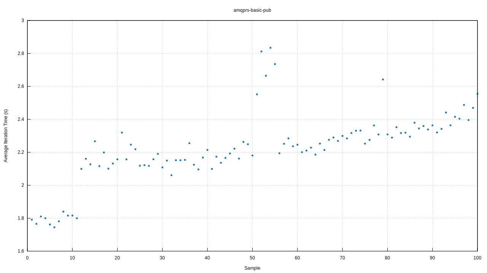
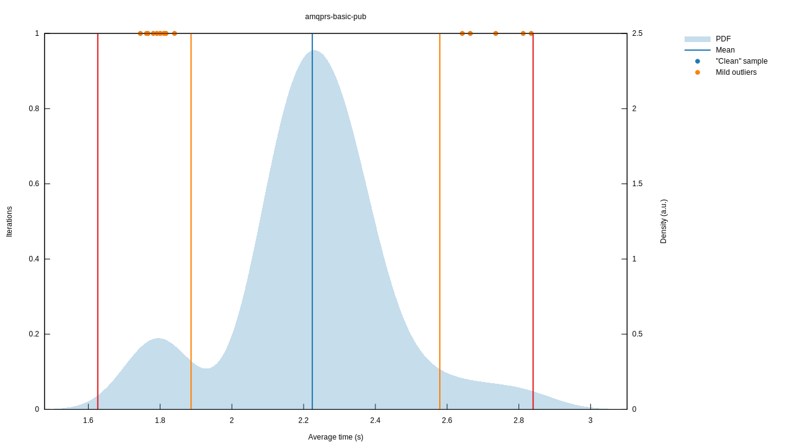
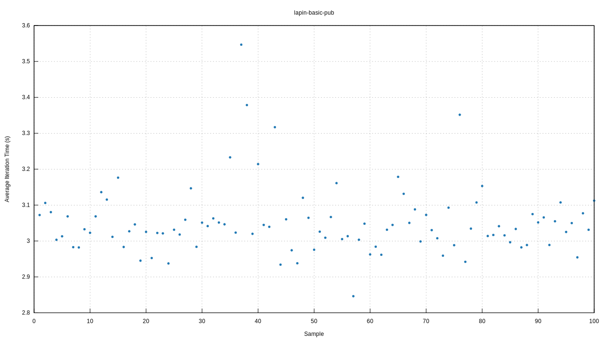
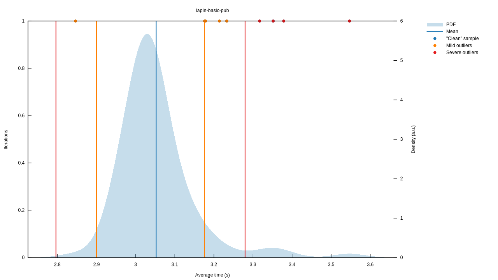

# Benchmarking async system

When benchmarking the async system not a single function, to get a stable results,
we run much longer duration in each iteration to reduce deviation.

# run_bench.sh

It uses criterion's `bencher` API for simple benchmarking, but it seems `lapin` cannot finish one iteration
during 3s warming up period, and result in IO error, so you may see error below
```bash
2023-02-10T13:52:01.953391Z ERROR lapin::io_loop: error doing IO error=IOError(Custom { kind: Other, error: "IO driver has terminated" })
```

It seems not reliable and not recommended to be used in the future.

# run_criterion.sh

This use criterion's API, and it runs OK for both `ampqrs` and `lapin`.

The result seems to vary a lot depends on which platform is run, but seems consistent on the same platform.

The benefits to use this is that it can generate the plots & graphs which is helpful to observe behavior pattern.

But, when we want to compare the wall-clock time performance when both clients perform same amount of message publishing, it is more reliable to use `run_native.sh` which simply calculate the eclapsed time.

# run_native.sh

This is useful to compare two clients wall-clock time performance when doing the same task.

# Plots from criterion benchmark

## amqprs



## lapin


